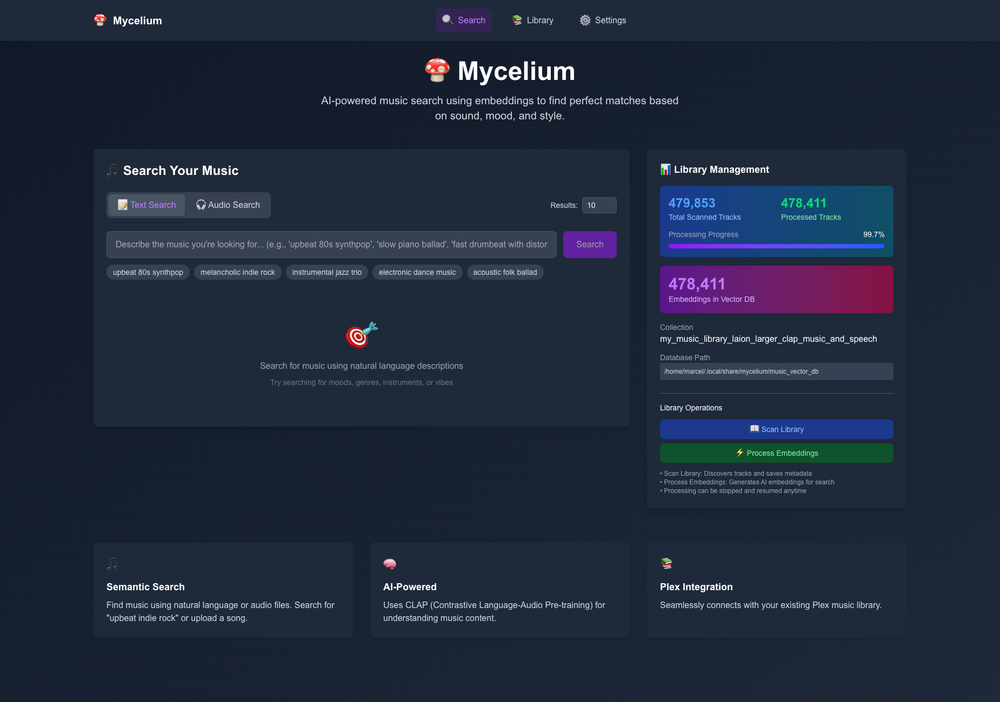
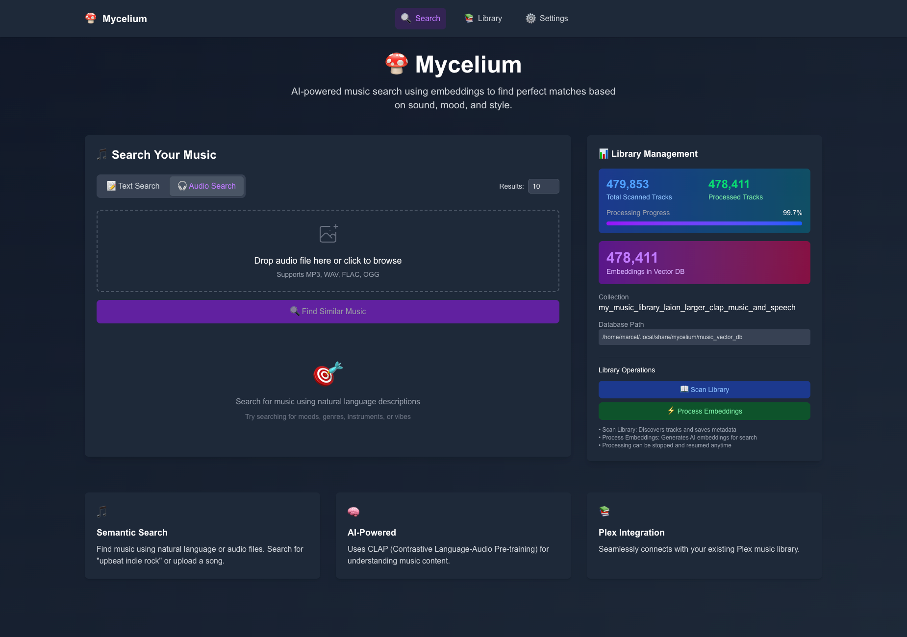
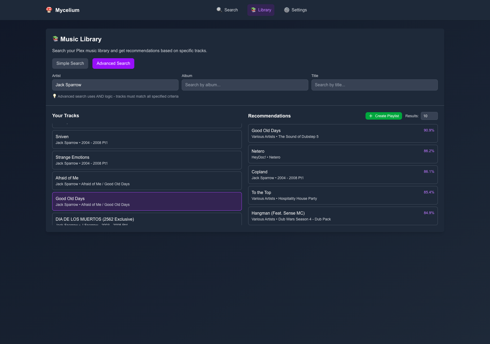

# 🍄 Mycelium

[](https://python.org)
[](https://fastapi.tiangolo.com/)
[](https://nextjs.org/)
[](LICENSE)
[](https://pytorch.org/)

AI-powered music recommendation system for Plex using semantic search with CLAP embeddings that understands both natural language and sonic characteristics.

## What is this?

Mycelium connects to your Plex media server and uses AI to understand your music collection. Search using natural language ("melancholic indie rock") or upload audio files to find similar tracks. Uses CLAP (Contrastive Language-Audio Pre-training) to analyze both text and audio features.

## How it works

1. **Scan** - Connects to Plex and extracts music metadata
2. **Process** - Generates AI embeddings using CLAP model  
3. **Search** - Find music using natural language or audio similarity
4. **Recommend** - Get AI-powered recommendations based on sonic qualities

**Tech Stack**: Python (FastAPI) + Next.js + ChromaDB vector database

## Features

**🔍 Smart Search**
- Text search: "upbeat 80s synthpop", "melancholic indie rock", "fast drumbeat"
- Audio search: Upload files to find similar tracks
- AI-powered recommendations

**🚀 Performance** 
- Distributed GPU processing for large libraries
- Resumable embedding generation
- Real-time progress tracking

**⚙️ Integration**
- Seamless Plex integration
- Modern web interface (Next.js + TypeScript)
- Web-based configuration

## Interface

### Smart Search
Search your library using natural language descriptions to find the perfect match for your mood.


### Audio Analysis
Upload any audio file to find tracks in your library with similar sonic characteristics.


### Library & Recommendations
Manage your collection and discover hidden gems through AI-powered recommendations.


## Setup

### Requirements
- Python 3.9+ and Node.js 18+
- Plex Media Server with music library
- GPU recommended for faster processing

### Installation

```bash
# Install from PyPI
pip install mycelium-ai
```

Or install from source:

```bash
# Clone and install
git clone https://github.com/marceljungle/mycelium.git
cd mycelium
pip install -e .

# Install frontend dependencies
cd frontend && npm install
```

### Quick Start

```bash
# Start server (web interface will open at http://localhost:8000)
mycelium-ai server

# For distributed processing with GPU workers (optional)
mycelium-ai client --server-host 192.168.1.100
```

## Usage

### Basic Workflow

```bash
# Start the server
mycelium-ai server

# Open http://localhost:8000 and:
# 1. Configure Plex connection in Settings
# 2. Scan your Plex library
# 3. Generate AI embeddings
# 4. Search and explore your music
```

### Available Commands

```bash
mycelium-ai server                         # Start server (API + Frontend)
mycelium-ai client --server-host HOST      # Start GPU worker client
```

### Web Interface

- **Search**: Natural language search ("upbeat indie rock", "slow tempo with piano") or upload audio files
- **Library**: Browse tracks, scan Plex library, and process embeddings  
- **Settings**: Configure Plex connection, API settings, and processing options via web interface

All configuration is done through the web interface at `http://localhost:8000`.

### Distributed Processing

For large libraries, use GPU workers for faster processing:

```bash
# On main server
mycelium-ai server

# On GPU machine(s)  
mycelium-ai client --server-host YOUR_SERVER_IP
```

## Development

### Setup

```bash
# Install backend with development dependencies
pip install -e ".[dev]"

# Install frontend dependencies
cd frontend && npm install
```

### Building

```bash
# Full build: OpenAPI clients + both frontends
./build.sh

# Build with Python package
./build.sh --with-wheel

# Skip certain stages
./build.sh --skip-openapi
./build.sh --skip-frontends
```

### Code Quality

```bash
# Python
black src/ && isort src/ && mypy src/

# Frontend
cd frontend && npm run lint && npm run build
```

## Project Structure

```
mycelium/
├── src/mycelium/           # Python backend (FastAPI + clean architecture)
│   ├── domain/             # Core business logic
│   ├── application/        # Use cases and services  
│   ├── infrastructure/     # External adapters (Plex, CLAP, ChromaDB)
│   ├── api/                # FastAPI endpoints
│   └── main.py             # CLI entry point
├── frontend/               # Next.js frontend (TypeScript + Tailwind)
│   └── src/components/     # React components
└── config.example.yml      # Configuration template
```

## Tips

- **Large libraries**: Use GPU workers (`mycelium-ai client`) for faster processing
- **Plex token**: Get from Plex settings → Network → "Show Advanced" 
- **Resume processing**: Embedding generation can be stopped and resumed anytime
- **Configuration**: All settings can be configured via the web interface at `/settings`

## Contributing

Contributions welcome! Ensure changes follow existing patterns, include TypeScript types, and use the logging system.

## License

MIT License - see [LICENSE](LICENSE) file.
