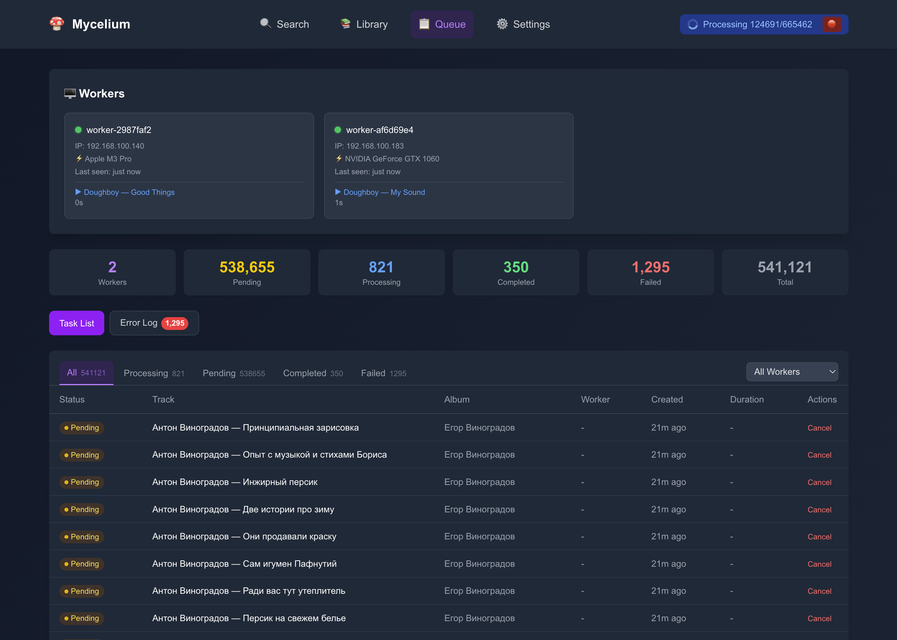
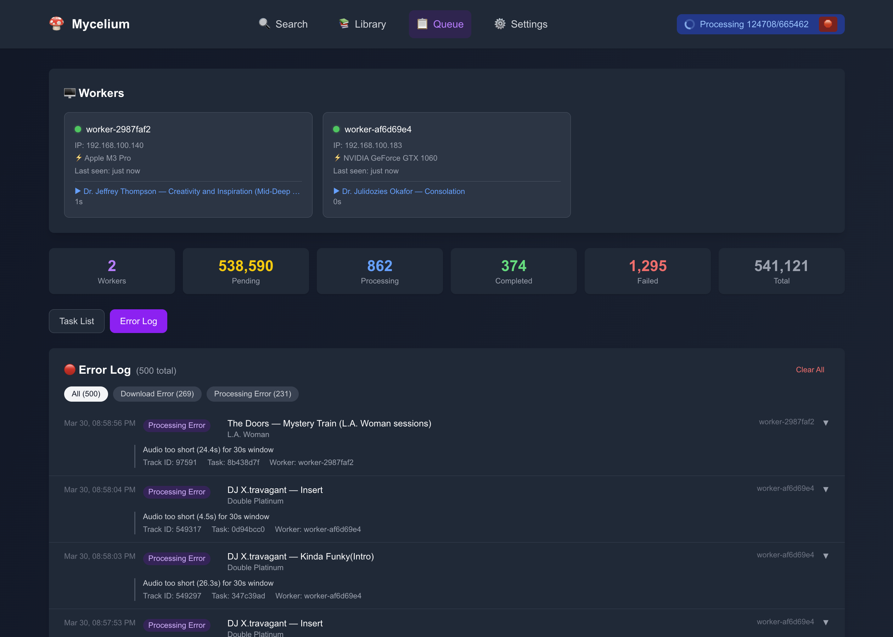

# Mycelium

[](https://python.org)
[](https://fastapi.tiangolo.com/)
[](https://nextjs.org/)
[](LICENSE)
[](https://pytorch.org/)

AI-powered music recommendation system for Plex. Uses semantic embeddings to understand your music collection and enables search by natural language descriptions or audio similarity.

## What is this?

Mycelium connects to your Plex media server and uses AI models to generate embeddings for your music library. You can then search using natural language ("melancholic indie rock with piano") or upload audio files to find sonically similar tracks. It supports three embedding models with different trade-offs between quality, capability, and resource usage.

## Embedding Models

Mycelium supports three embedding models. The model determines what search modes are available and how accurately music similarity is captured.

| | MuQ (audio-only) | MuQ-MuLan (audio + text) | CLAP (audio + text) |
|---|---|---|---|
| **Acoustic quality** | Best (95%) | Very good (90%) | Good (70%) |
| **Semantic understanding** | N/A | Very good (85%) | Good (80%) |
| **Text search** | No | Yes | Yes |
| **Audio search** | Yes | Yes | Yes |
| **VRAM usage** | ~3 GB | ~5 GB | ~2 GB |
| **Sample rate** | 24 kHz | 24 kHz | 48 kHz |
| **Architecture** | Mel-RVQ SSL | Mel-RVQ + MuLan text tower | HTSAT + RoBERTa |
| **Best for** | Instrumental, electronic, acoustic similarity | General use with text search | Legacy / low VRAM setups |

**MuQ** (`OpenMuQ/MuQ-large-msd-iter`) produces the highest-fidelity acoustic representations. It captures timbral, rhythmic, and structural features better than the other models. Ideal for electronic music, instrumentals, or any use case where audio similarity is the priority. The trade-off is no text search support.

**MuQ-MuLan** (`OpenMuQ/MuQ-MuLan-large`) extends MuQ with a MuLan text tower for text-based search. It retains most of MuQ's acoustic quality while adding natural language queries. The text tower introduces a slight accuracy loss on pure acoustic matching but enables searching by description ("fast drumbeat", "ambient synth pad"). Higher VRAM usage than either alternative.

**CLAP** (`laion/larger_clap_music_and_speech`) is the legacy model. Lower acoustic quality than MuQ variants but requires the least VRAM and supports text search. Suitable for smaller GPU setups or when upgrading from an existing CLAP-based installation.

All models use windowed mean pooling (non-overlapping chunks) with L2 normalization. Switching models requires re-processing the entire library.

## Features

- **Text search** — Search by natural language description (requires CLAP or MuQ-MuLan)
- **Audio search** — Upload audio files to find similar tracks in your library
- **Similar tracks** — Click any track to discover sonically similar music
- **Plex playlist creation** — Create Plex playlists directly from search results
- **Distributed GPU processing** — Offload embedding computation to GPU worker machines
- **Resumable processing** — Stop and resume embedding generation at any time
- **Processing queue dashboard** — Monitor workers, tasks, and errors in real-time
- **Hot-reloadable configuration** — Change settings via the web UI without restarting
- **Library management** — Browse, search, and filter your track database with pagination
- **Error tracking** — Structured error log with per-file failure details (download/processing)
- **Worker auto-discovery** — Workers register with GPU info, heartbeat monitoring, stale cleanup

## Architecture

```
                          Browser
                            |
                     Next.js Frontend
                   (static build, port 8000)
                            |
                        REST API
                            |
               +------------+------------+
               |                         |
         FastAPI Server              Job Queue
         (port 8000)              (task coordination)
               |                         |
        +------+------+          +------+------+
        |      |      |          |             |
      Plex  SQLite  ChromaDB   GPU Workers (optional)
     (media) (meta) (vectors)  (port 3001 each)
```

### Request Flow — Text Search

```
Query: "melancholic indie rock"
  -> POST /api/search/text
  -> If workers active: create task -> worker encodes text -> cosine search in ChromaDB
  -> If no workers: server encodes text locally -> cosine search in ChromaDB
  -> Return top N similar tracks with similarity scores
```

### Request Flow — Library Processing

```
Click "Process Embeddings"
  -> POST /api/library/process
  -> Creates tasks for all unprocessed tracks
  -> Workers poll for jobs, download audio, compute embeddings, submit results
  -> Server stores embeddings in ChromaDB, marks tracks as processed
  -> Falls back to server-side processing if no workers available
```

### Adding a New Embedding Model

```
1. Create adapter:  backend/mycelium/infrastructure/model/your_model.py
   (implement EmbeddingGenerator interface)

2. Register:        backend/mycelium/application/embedding/registry.py
   (add one ModelSpec entry to MODEL_REGISTRY)

Config, CLI, and frontend pick it up automatically.
```

## Interface

### Text Search
Search your library using natural language descriptions.


### Audio Search
Upload any audio file to find tracks with similar sonic characteristics.


### Library
Browse your collection with filters. Click any track to find similar music.


### Processing Queue
Monitor workers, task progress, and errors in real-time.



## Setup

### Requirements
- Python 3.9+ and Node.js 18+
- Plex Media Server with a music library
- GPU recommended (CUDA) for embedding generation

### Installation

```bash
pip install mycelium-ai
```

From source:

```bash
git clone https://github.com/marceljungle/mycelium.git
cd mycelium
pip install -e .
cd frontend && npm install
```

### Quick Start

```bash
# Start server (opens http://localhost:8000)
mycelium-ai server

# Configure Plex connection in Settings, then:
# 1. Scan your library
# 2. Process embeddings
# 3. Search

# Optional: GPU workers for faster processing
mycelium-ai client --server-host 192.168.1.100
```

## Configuration

All configuration is done through the web interface at `http://localhost:8000/settings` or by editing YAML files directly.

### Server (`~/.config/mycelium/config.yml`)

Auto-generated on first run. Key settings:

| Section | Options |
|---------|---------|
| `plex` | `url`, `token`, `music_library_name` |
| `embedding` | `type`: `clap`, `muq`, or `muq_mulan` |
| `clap` | `model_id`, `target_sr`, `chunk_duration_s`, `micro_batch_size` |
| `muq` | `model_id`, `target_sr`, `chunk_duration_s`, `micro_batch_size` |
| `muq_mulan` | `model_id`, `target_sr`, `chunk_duration_s`, `micro_batch_size` |
| `api` | `host`, `port`, `reload` |
| `server` | `gpu_batch_size` |
| `chroma` | `collection_name`, `batch_size` |
| `logging` | `level` |

### Worker (`~/.config/mycelium/client_config.yml`)

Required only for GPU workers:

| Section | Options |
|---------|---------|
| `client` | `server_host`, `server_port`, `gpu_batch_size`, `download_workers`, `poll_interval` |
| `client_api` | `host`, `port` |
| `logging` | `level` |

Both configs support hot-reload via their respective `POST /api/config` endpoints.

## Distributed Processing

For large libraries, run GPU workers on separate machines:

```bash
# Main server
mycelium-ai server

# GPU machine(s) — each registers automatically
mycelium-ai client --server-host YOUR_SERVER_IP
```

Workers register with the server, report their GPU name, and poll for tasks. The server distributes unprocessed tracks as batched jobs. Multiple workers can run in parallel. Worker health is tracked via heartbeats (60s timeout).

Monitor worker status, task progress, and errors in the Processing Queue page of the web interface.

## API

Interactive API docs are available at `http://localhost:8000/docs` (Swagger UI).

Key endpoints:

| Method | Endpoint | Description |
|--------|----------|-------------|
| `GET` | `/api/search/text?q=...` | Text-based semantic search |
| `POST` | `/api/search/audio` | Audio file similarity search |
| `POST` | `/api/library/scan` | Scan Plex library |
| `POST` | `/api/library/process` | Start embedding processing |
| `POST` | `/api/library/process/stop` | Stop processing |
| `GET` | `/api/library/stats` | Database statistics |
| `GET` | `/api/library/tracks` | Paginated track list with filters |
| `GET` | `/api/capabilities` | Model capabilities (text search support) |
| `GET/POST` | `/api/config` | Read/write server configuration |
| `POST` | `/api/playlists/create` | Create Plex playlist from results |
| `GET` | `/api/queue/overview` | Worker status and queue stats |
| `GET` | `/api/errors` | Structured error log |

## Development

```bash
# Install with dev dependencies
pip install -e ".[dev]"
cd frontend && npm install

# Build both frontends
./build.sh

# Build with Python wheel
./build.sh --with-wheel

# Code quality
black src/ && isort src/ && mypy src/
cd frontend && npm run lint && npm run build
```

## Project Structure

```
mycelium/
  backend/mycelium/
    domain/                  # Core models and repository interfaces
    application/             # Use cases, services, model registry, job queue
    infrastructure/          # Plex adapter, ChromaDB, SQLite, embedding models
    api/                     # FastAPI endpoints, Pydantic DTOs
    config.py                # Server configuration (YAML)
    client_config.py         # Worker configuration (YAML)
    client.py                # GPU worker implementation
    main.py                  # CLI entry point
  frontend/
    src/server_api/          # TypeScript API client + types (hand-written)
    src/worker_api/          # Worker API client + types (hand-written)
    src/components/          # React components
  build.sh                   # Build orchestrator
  config.example.yml         # Server config template
  client_config.example.yml  # Worker config template
```

## License

MIT License — see [LICENSE](LICENSE).
